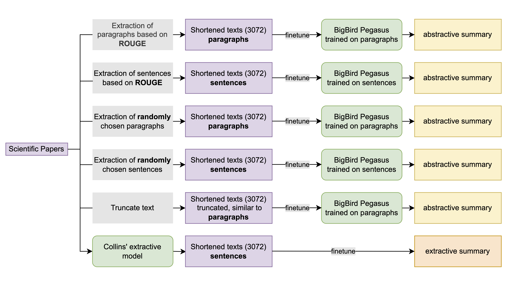

# Abstractive Summarization

*Semester Project*: Advanced Techniques of Text Mining, University of Zurich (June 2022)  
*Authors*: Deborah Jakobi, Helen Schaller, Laura Stahlhut

We explore different techniques of shortening academic papers as a preprocessing step to fit the maximum input length
of a pretrained model for abstractive summarization.

## Automatic text summarization
The aim of automatic summarization is to shorten a text computationally in such a way that the summary contains the most
relevant information of the source text.
**Extractive summarization** shortens a text by selecting key phrases from the source text while
**abstractive summarization** generates a new text that is shorter than the source text.
 
### Problem and task description
The issue with pretrained abstractive models is the limited input size. Texts that are too long typically get truncated 
which is problematic with texts such as academic papers where the beginning (abstract and introduction) is rather 
repetitive and does not contain all of the most important aspects of the text. Thus, our task is to explore different 
preprocessing methods to perform on academic journals before using them as an input to a pretrained model for abstractive 
summarization.

## Data
The dataset [CSPubSum](https://aclanthology.org/K17-1021) (Collins et al., 2017) consists of more than
10,000 scientific papers from computer science ob-tained from ScienceDirect, a database for scientific
publications. Each paper has author-written 'highlight statements' which summarise the main findings of each 
contribution.

## Approach
All experiments consist of an extractive followed
by an abstractive summarisation step. The extractive model varies from setup to setup and serves
the purpose to shorten the scientific papers to maximally 3072 tokens. The abstractive model is always 
[BIGBIRDPEGASUS](https://huggingface.co/google/bigbird-pegasus-large-arxiv) provided by Huggingface, 
finetuned on the extracted text (individually for each extraction method).   

We use the following methods as preprocessing steps before finetuning the abstractive model: 
- Letting the model truncate the text after maximum input length has been reached (pipeline 5). This serves as a baseline.
- Random extraction of paragraphs or sentences from the text. This ensures that information from throughout the entire text
are present in the model input. 
- Extraction of paragraphs or sentences based on ROUGE scores (pipelines 1 & 2). This is based on the assumption that 
important information will be mentioned repeatedly. 
- Using Collins' extractive model to extract key phrases that are used as an input to the abstractive model.

## Evaluation
Following current practice, we report the results of
our experiments using ROUGE scores. Rouge-N measures the N-gram recall between a generated
summary and a reference summary while ROUGE-L measures the longest common subsequence of
candidate and reference. 
Our results show that our ROUGE-based ex-tractive step did not improve the results compared
to truncating the texts. However, we observed that finetuning the abstractive model on individual sentences may yield 
better results in some scenarios than using coherent text in the form of paragraphs.

## Sources
Ed Collins, Isabelle Augenstein, and Sebastian Riedel. 2017. A Supervised Approach to Extractive Summarisation of Scientific Papers. In Proceedings of the 21st Conference on Computational Natural Language Learning (CoNLL 2017), pages 195–205, Vancouver, Canada. Association for Computational Linguistics.

## License
[MIT](https://choosealicense.com/licenses/mit/)